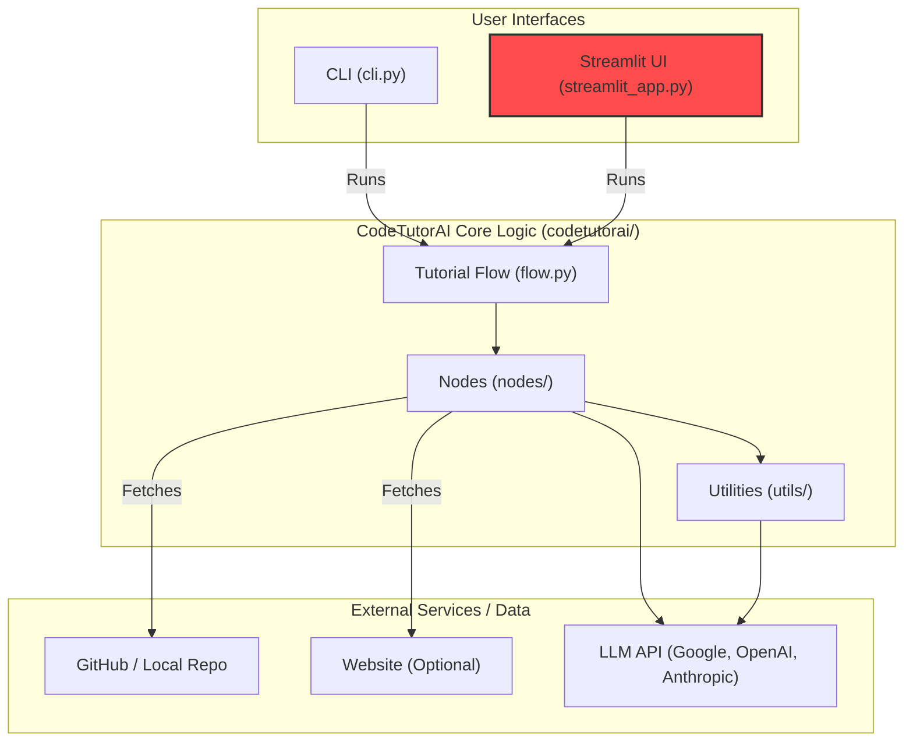

# CodeTutorAI – Turn GitHub Repos into Interactive Tutorials

>*Lost in someone else's GitHub project? Build an AI Code Explainer to generate clear explanations! This tutorial shows you how to create an agent that analyzes repositories and produces easy-to-understand guides.*


```plaintext
          .--""--.           _______          __       _______       __              _______ ___
         |________|         |   _   .-----.--|  .-----|       .--.--|  |_.-----.----|   _   |   |
             ||             |.  1___|  _  |  _  |  -__|.|   | |  |  |   _|  _  |   _|.  1   |.  |
             ()             |.  |___|_____|_____|_____`-|.  |-|_____|____|_____|__| |.  _   |.  |
      <-------------->      |:  1   |                   |:  |                       |:  |   |:  |
     / \____________/ \     |::.. . |                   |::.|                       |::.|:. |::.|
    /___\__________/___\    `-------'                   `---'                       `--- ---`---'
```

**CodeTutorAI** is an AI-powered system that transforms any GitHub repository into a beginner-friendly, tutorial-style walkthrough. It analyzes the structure, abstractions, and relationships within a codebase to produce a multi-chapter guide that helps you deeply understand the inner workings of unfamiliar projects.

---

## 🔍 What Is CodeTutorAI?

CodeTutorAI acts as a digital oracle for codebases — using AI to reveal the design, purpose, and interactions between the components of any GitHub repository. Think of it as a magnifying glass for developers who want to uncover the story behind someone else’s code.

### Core Features

- 🧠 Uses LLMs (Google Gemini, OpenAI, Anthropic) to identify and explain key abstractions.
- 🕸️ Maps out relationships and architecture visually.
- 📘 Generates structured Markdown tutorials.
- 🌐 Output is ready for GitHub Pages or docs hosting.
- 🌍 Supports multiple languages for global accessibility (LLM dependent).
- 📊 Generates Mermaid diagrams for visual understanding.
- 🎯 Adjustable depth levels (basic, intermediate, advanced) for different expertise levels.
- 🖥️ Interactive HTML viewer for better reading experience.
- ✨ **NEW:** Interactive Streamlit UI for easy configuration and generation.
- ☁️ **NEW:** Support for Google Gemini, OpenAI, and Anthropic models with dynamic model selection.
- 💾 **NEW:** Persistent LLM response caching (enabled by default) with manual clearing via UI.
- 🔄 **NEW:** Option to force regeneration, ignoring the cache.
- 📂 **NEW:** Structured output directories per repository (`<user>_<repo>`).
- 📜 **NEW:** Generation history tracking (URL, config, output path) saved in `generation_history.json`.
- ⏱️ **NEW:** Displays total generation time in the UI.
- 🖱️ **NEW:** GitHub URL history dropdown in the UI for quick selection.

---

## ⚙️ How It Works

CodeTutorAI operates as a modular AI workflow that progresses through the following steps:



Each node is powered by prompts to a large language model (LLM), enabling intelligent interpretation of even complex, multi-language codebases. The Streamlit UI provides a user-friendly way to configure and run the generation process.

---

## 🚀 Getting Started

### 1. Clone the Repository

```bash
# Clone the repository
git clone https://github.com/Mathews-Tom/CodeTutorAI.git
cd CodeTutorAI
```

### 2. Create and Activate Virtual Environment

```bash
# Create a virtual environment (recommended)
python3 -m venv .venv

# Activate it
# On macOS/Linux:
source .venv/bin/activate
# On Windows:
# .venv\Scripts\activate
```

### 3. Install Dependencies

```bash
# Using pip (within the activated environment)
pip install -r requirements.txt

# Or install in editable mode for development
pip install -e .

# Using uv (optional, faster)
# pip install uv
# uv pip install -r requirements.txt
```

### 4. Set Up Environment Variables

Create a `.env` file in the project root directory (`CodeTutorAI/`) and add your API keys. The application requires the key for the selected LLM provider.

```bash
# Example .env file
GOOGLE_API_KEY=your_google_api_key_here
OPENAI_API_KEY=your_openai_api_key_here
ANTHROPIC_API_KEY=your_anthropic_api_key_here
```
The application will load these automatically.

### 5. Run CodeTutorAI

#### Using the Streamlit UI (Recommended)

This is the easiest way to use CodeTutorAI. Ensure your virtual environment is activated.

```bash
streamlit run streamlit_app.py
```
This will open the web interface in your browser. Configure the options and click "Generate Tutorial".

**Key UI Features:**
*   Select LLM Provider (Google, OpenAI, Anthropic) and specific Model.
*   Enter GitHub Repository URL (with history dropdown).
*   Configure output directory, depth, language, formats.
*   Enable/disable diagram generation and auto-viewer opening.
*   Manage caching: Enable/disable, clear cache, force regeneration.
*   View generation progress and final status (including time taken and cache status).
*   Reset application state.

#### As a Command-Line Tool

After installation (`pip install -e .`), you can run CodeTutorAI from the command line (ensure the virtual environment is active):

```bash
# Basic usage
codetutorai https://github.com/SomeUser/SomeProject --output-dir ./tutorial_output

# Example with options
codetutorai https://github.com/tiangolo/fastapi \
  --output-dir ./fastapi_tutorial \
  --depth advanced \
  --language en \
  --llm-provider Google \
  --output-formats markdown,viewer \
  --diagrams \
  --open-viewer
```

#### As a Python Module

```bash
# Ensure virtual environment is active
python -m codetutorai.cli https://github.com/SomeUser/SomeProject --output-dir ./docs
# Or with python3 explicitly
python3 -m codetutorai.cli https://github.com/SomeUser/SomeProject --output-dir ./docs
```

#### CLI Optional Flags

```bash
  --web-url URL           # Additional web context URL
  --include PATTERNS      # Comma-separated file patterns to include (e.g., "*.py,*.js")
  --exclude PATTERNS      # Comma-separated file patterns to exclude (e.g., "test_*,*__pycache__*")
  --llm-provider PROVIDER # LLM provider (Google, OpenAI, Anthropic)
  --api-key KEY           # Override API key from .env
  --batch-size N          # Number of chapters to generate in parallel (default: 1)
  --output-formats F1,F2  # Output formats (markdown, html, pdf, viewer)
  --depth LEVEL           # Tutorial depth (basic, intermediate, advanced)
  --language CODE         # Tutorial language (ISO 639-1 code, e.g., es, fr, ja)
  --diagrams              # Generate Mermaid diagrams
  --open-viewer           # Open the HTML viewer automatically
  --cache-dir PATH        # Specify cache directory (default: .llm_cache)
  --no-cache              # Disable LLM caching
  --force-regeneration    # Force regeneration, ignore cache (CLI equivalent of UI checkbox)
  --verbose               # Enable verbose output
```

---

## 🧱 Folder Structure

```plaintext
CodeTutorAI/
├── .env                            # Local environment variables (API keys)
├── .env.example                    # Example environment variables
├── .gitignore                      # Git ignore rules
├── .venv/                          # Python virtual environment (created by user)
├── assets/                         # Logos, banners, etc.
│   ├── CodeTutorAI-Banner.png      # Project Banner Image
│   ├── banner.txt                  # ASCII Art Banner
│   └── logo.txt                    # ASCII Art Logo
├── docs/                           # Default output for generated documentation examples
├── generation_history.json         # Tracks generation runs (created in output dir)
├── install_dev.sh                  # Development installation script
├── LICENSE                         # MIT License
├── overview.md                     # Detailed system overview document
├── pyproject.toml                  # Project metadata (PEP 621)
├── README.md                       # This file
├── requirements.txt                # Python dependencies
├── setup.py                        # Package setup script (uses pyproject.toml)
├── src/                            # Source code directory
│   └── codetutorai/                # Main package (NEEDS MANUAL RENAME from enlightenai)
│       ├── __init__.py             # Package initialization
│       ├── cli.py                  # CLI entry point
│       ├── flow.py                 # Defines the main tutorial generation workflow
│       ├── nodes/                  # Node implementations for each step
│       │   ├── __init__.py
│       │   ├── node.py             # Base Node class
│       │   └── ... (other node files)
│       └── utils/                  # Utility scripts
│           ├── __init__.py
│           ├── constants.py
│           ├── formatting.py
│           ├── history_manager.py  # NEW: Handles generation history
│           ├── html_viewer.py
│           ├── llm_client.py       # Enhanced LLM client
│           └── ... (other util files)
├── streamlit_app.py                # NEW: Main Streamlit UI application script
└── tutorial_output/                # Default output directory for tutorials
    └── <user>_<repo>/              # NEW: Subdirectory for each generated repo
        ├── index.md
        ├── chapters/
        ├── diagrams/
        └── viewer/                 # If HTML viewer format is selected
```

---

## 📘 Example Output

Explore the `docs/` folder for examples or try CodeTutorAI on a real repo:

```bash
# Using the CLI tool
codetutorai https://github.com/tiangolo/fastapi

# Or using the Streamlit UI
streamlit run streamlit_app.py
# Then enter https://github.com/tiangolo/fastapi in the UI
```

---

## 🛠 Tech Stack

- **Python**
- **Streamlit** (for Web UI)
- **LLMs** (configurable: Google Gemini, OpenAI, Anthropic Claude)
- **Custom Flow Engine** for workflow orchestration
- **python-dotenv** (for environment variable loading)
- **diskcache** (for LLM response caching)
- **google-generativeai** (for Google Gemini API)
- **requests** (for Anthropic/OpenAI APIs)
- **gitpython** (used by FetchRepoGitinNode)
- **beautifulsoup4** (used by FetchWebNode)
- **tqdm** (for progress tracking)
- **tiktoken** (for token counting)
- **tenacity** (for retry logic)
- **Markdown + MermaidJS** for documentation output

---

## 📄 License

MIT License. See `LICENSE` for details.

---

> Built with 🔮 by [Mathews Tom](https://github.com/Mathews-Tom)
