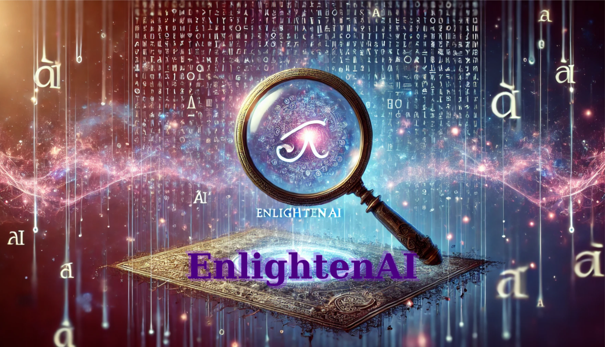
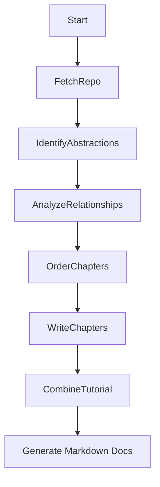

# 🌟 🔍 EnlightenAI – Illuminate the Hidden Logic Within Codebases

>*Lost in someone else's GitHub project? Build an AI Code Explainer to generate clear explanations! This tutorial shows you how to create an agent that analyzes repositories and produces easy-to-understand guides.*



**EnlightenAI** is an AI-powered system that transforms any GitHub repository into a beginner-friendly, tutorial-style walkthrough. It analyzes the structure, abstractions, and relationships within a codebase to produce a multi-chapter guide that helps you deeply understand the inner workings of unfamiliar projects.

---

## 🔍 What Is EnlightenAI?

EnlightenAI acts as a digital oracle for codebases — using AI to reveal the design, purpose, and interactions between the components of any GitHub repository. Think of it as a magnifying glass for developers who want to uncover the story behind someone else’s code.

### Core Features

- 🧠 Uses LLMs to identify and explain key abstractions
- 🕸️ Maps out relationships and architecture visually
- 📘 Generates structured Markdown tutorials
- 🌐 Output is ready for GitHub Pages or docs hosting

---

## ⚙️ How It Works

EnlightenAI operates as a modular AI workflow that progresses through the following steps:



Each node is powered by prompts to a large language model (LLM), enabling intelligent interpretation of even complex, multi-language codebases.

---

## 🚀 Getting Started

### 1. Clone the Repository

```bash
git clone https://github.com/Mathews-Tom/EnlightenAI.git
cd EnlightenAI
```

### 2. Install Dependencies

```bash
pip install -e .
```

Or for development:

```bash
./install_dev.sh
```

### 3. Set Up Environment Variables

Create a `.env` file with your API keys:

```bash
OPENAI_API_KEY=your_openai_api_key_here
# Optional: Add other API keys if needed
# ANTHROPIC_API_KEY=your_anthropic_api_key_here
# GOOGLE_API_KEY=your_google_api_key_here
```

### 4. Run EnlightenAI on a GitHub Repo

```bash
enlightenai https://github.com/SomeUser/SomeProject --output-dir ./docs
```

#### Optional flags

```bash
  --web-url https://example.com/docs  # Additional web context
  --include "*.py,*.md"               # File patterns to include
  --exclude "test_*,*__pycache__*"    # File patterns to exclude
  --llm-provider openai               # LLM provider (openai, anthropic, palm)
  --api-key YOUR_API_KEY              # Override API key from .env
  --verbose                           # Enable verbose output
```

### 5. Run with Mock Data for Testing

```bash
python -m enlightenai.test_mock --verbose
```

---

## 🧱 Folder Structure

```plaintext
EnlightenAI/
├── src/                  # Source code directory
│   └── enlightenai/      # Main package
│       ├── __init__.py    # Package initialization
│       ├── cli.py         # CLI entry point
│       ├── flow.py        # Defines the AI workflow
│       ├── nodes/         # Node implementations for each step
│       │   ├── __init__.py # Node package initialization
│       │   ├── node.py     # Base Node class
│       │   ├── fetch_repo_gitin.py # GitHub repository fetching
│       │   ├── fetch_web.py # Web content fetching
│       │   ├── identify_abstractions.py # Abstraction identification
│       │   ├── analyze_relationships.py # Relationship analysis
│       │   ├── order_chapters.py # Chapter ordering
│       │   ├── write_chapters.py # Chapter writing
│       │   └── combine_tutorial.py # Tutorial combination
│       └── utils/         # Utility scripts
│           ├── __init__.py # Utils package initialization
│           ├── call_llm.py # LLM client compatibility layer
│           ├── llm_client.py # Enhanced LLM client
│           ├── formatting.py # Formatting utilities
│           └── mock_data.py # Mock data for testing
├── nodes/                 # Node implementations (for development)
├── utils/                 # Utility scripts (for development)
├── docs/                  # Output tutorials
├── setup.py               # Package setup script
├── requirements.txt       # Python dependencies
├── install_dev.sh         # Development installation script
└── README.md              # You're here!
```

---

## 📘 Example Output

Explore the `docs/` folder or try EnlightenAI on a real repo like:

```bash
enlightenai https://github.com/tiangolo/fastapi
```

Check back soon for live demo links and tutorial showcases!

---

## 🛠 Tech Stack

- **Python**
- **LLMs** (configurable: OpenAI, Anthropic Claude, Google PaLM)
- **Custom Flow Engine** for workflow orchestration
- **gitin** for GitHub repository crawling
- **crawl4ai** for web content crawling
- **tqdm** for progress tracking
- **Markdown + MermaidJS** for documentation

---

## 📄 License

MIT License. See `LICENSE` for details.

## 🧙‍♂️🌀 “The Oracle’s Lens” - Banner Concept

An ancient yet futuristic magnifying lens floats above a glowing, semi-transparent scroll of symbolic code. Under the lens, cryptic symbols shift into radiant patterns, revealing insights or illuminated shapes — as if the AI oracle is interpreting the code’s hidden meaning.

### 🎨 Visual Elements

- Floating Magnifier: Suspended mid-air, glowing faintly (gold, silver, or ethereal blue), with ornate or arcane designs etched into the rim
- Digital Scroll: A holographic or semi-paper scroll unrolling below, filled with mysterious glyphs, symbols, or flowing syntax-like patterns
- Revealed Area: The magnifier reveals a different “truth” — glowing connections, diagrams, or an “enlightened” region on the scroll
- Background: A mystical space with floating particles, soft constellations or runes in the background — cosmic but subtle
- Typography (optional): The name EnlightenAI in elegant, slightly serif or script-like typeface, glowing or carved into the background

### 🧠 Mood

- Mystical AI scribe meets digital prophet
- Blends ancient aesthetics (scroll, symbols) with a futuristic, magical HUD feel
- Tells the story of revealing what was always there, hidden beneath the code

### 🖼️ Composition

- Banner-style (wider than tall) to fit GitHub headers (ideal: 1280x400 or scalable)
- Magnifier centered or slightly off-center with radiating light
- Scroll wraps across bottom or diagonally with abstract symbols flowing along it

---

> Built with 🔮 by [Mathews Tom](https://github.com/Mathews-Tom)
