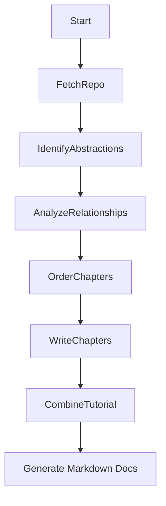

# 🪄 EnlightenAI – Illuminate the Hidden Logic Within Codebases 🔍

```plaintext


     ##### ##                 ###                             /                                                ##                #####  #
  ######  /### /               ###      #                   #/                                              /####             ######  /
 /#   /  / ###/                 ##     ###                  ##            #                                /  ###            /#   /  /
/    /  /   ##                  ##      #                   ##           ##                                   /##           /    /  /
    /  /                        ##                          ##           ##                                  /  ##              /  /
   ## ##         ###  /###      ##    ###         /###      ##  /##    ########    /##    ###  /###          /  ##             ## ##
   ## ##          ###/ #### /   ##     ###       /  ###  /  ## / ###  ########    / ###    ###/ #### /      /    ##            ## ##
   ## ######       ##   ###/    ##      ##      /    ###/   ##/   ###    ##      /   ###    ##   ###/       /    ##          /### ##
   ## #####        ##    ##     ##      ##     ##     ##    ##     ##    ##     ##    ###   ##    ##       /      ##        / ### ##
   ## ##           ##    ##     ##      ##     ##     ##    ##     ##    ##     ########    ##    ##       /########           ## ##
   #  ##           ##    ##     ##      ##     ##     ##    ##     ##    ##     #######     ##    ##      /        ##     ##   ## ##
      /            ##    ##     ##      ##     ##     ##    ##     ##    ##     ##          ##    ##      #        ##    ###   #  /
  /##/         /   ##    ##     ##      ##     ##     ##    ##     ##    ##     ####    /   ##    ##     /####      ##    ###    /
 /  ##########/    ###   ###    ### /   ### /   ########    ##     ##    ##      ######/    ###   ###   /   ####    ## /   #####/
/     ######        ###   ###    ##/     ##/      ### ###    ##    ##     ##      #####      ###   ### /     ##      #/      ###
#                                                      ###         /                                   #
 ##                                              ####   ###       /                                     ##
                                               /######  /#       /
                                              /     ###/        /

```

```plaintext
   _     _     _     _     _
  / \   / \   / \   / \   / \
 (🪄 ) ( E ) ( A ) ( I ) (🔍 )
  \_/   \_/   \_/   \_/   \_/
```

>*Lost in someone else's GitHub project? Build an AI Code Explainer to generate clear explanations! This tutorial shows you how to create an agent that analyzes repositories and produces easy-to-understand guides.*

**EnlightenAI** is an AI-powered system that transforms any GitHub repository into a beginner-friendly, tutorial-style walkthrough. It analyzes the structure, abstractions, and relationships within a codebase to produce a multi-chapter guide that helps you deeply understand the inner workings of unfamiliar projects.

---

## 🔍 What Is EnlightenAI?

EnlightenAI acts as a digital oracle for codebases — using AI to reveal the design, purpose, and interactions between the components of any GitHub repository. Think of it as a magnifying glass for developers who want to uncover the story behind someone else’s code.

### Core Features

- 🧠 Uses LLMs to identify and explain key abstractions
- 🕸️ Maps out relationships and architecture visually
- 📘 Generates structured Markdown tutorials
- 🌐 Output is ready for GitHub Pages or docs hosting
- 🌍 Supports multiple languages for global accessibility
- 📊 Generates Mermaid diagrams for visual understanding
- 🎯 Adjustable depth levels for different expertise levels
- 🖥️ Interactive HTML viewer for better reading experience

---

## ⚙️ How It Works

EnlightenAI operates as a modular AI workflow that progresses through the following steps:



Each node is powered by prompts to a large language model (LLM), enabling intelligent interpretation of even complex, multi-language codebases.

---

## 🚀 Getting Started

### 1. Clone the Repository

```bash
git clone https://github.com/Mathews-Tom/EnlightenAI.git
cd EnlightenAI
```

### 2. Install Dependencies

#### Using pip

```bash
# Install from the current directory
pip install -e .

# Or install directly from GitHub
pip install git+https://github.com/Mathews-Tom/EnlightenAI.git
```

#### Using uv (faster installation)

```bash
# Install uv if you don't have it
pip install uv

# Install from the current directory
uv pip install -e .

# Or install directly from GitHub
uv pip install git+https://github.com/Mathews-Tom/EnlightenAI.git
```

#### For Development

```bash
# Using the provided script
./install_dev.sh

# Or manually
pip install -e .
```

### 3. Set Up Environment Variables

Create a `.env` file with your API keys:

```bash
OPENAI_API_KEY=your_openai_api_key_here
# Optional: Add other API keys if needed
# ANTHROPIC_API_KEY=your_anthropic_api_key_here
# GOOGLE_API_KEY=your_google_api_key_here
```

### 4. Run EnlightenAI on a GitHub Repo

#### As a Command-Line Tool

After installation, you can run EnlightenAI directly from the command line:

```bash
# Using the command-line tool
enlightenai https://github.com/SomeUser/SomeProject --output-dir ./docs
```

#### As a Python Module

You can also run EnlightenAI as a Python module:

```bash
# Using Python module syntax
python -m enlightenai.cli https://github.com/SomeUser/SomeProject --output-dir ./docs

# Or with python3 explicitly
python3 -m enlightenai.cli https://github.com/SomeUser/SomeProject --output-dir ./docs
```

#### Optional Flags

```bash
  --web-url https://example.com/docs  # Additional web context
  --include "*.py,*.md"               # File patterns to include
  --exclude "test_*,*__pycache__*"    # File patterns to exclude
  --llm-provider openai               # LLM provider (openai, anthropic, palm)
  --api-key YOUR_API_KEY              # Override API key from .env
  --batch-size 2                      # Number of chapters to generate in parallel
  --output-formats markdown,html,pdf,viewer  # Output formats to generate
  --verbose                           # Enable verbose output

  # New features in Phase 10
  --depth basic|intermediate|advanced # Depth of the tutorial (default: intermediate)
  --language en                       # Language for the tutorial (ISO 639-1 code)
  --diagrams                          # Generate Mermaid diagrams for classes and components
  --open-viewer                       # Open the HTML viewer in the default web browser
```

### 5. Interactive HTML Viewer

EnlightenAI can generate an interactive HTML viewer for the tutorial:

```bash
# Generate a tutorial with the HTML viewer
enlightenai https://github.com/username/repository --output-formats markdown,viewer

# Generate and automatically open the viewer in your browser
enlightenai https://github.com/username/repository --output-formats viewer --open-viewer
```

The HTML viewer provides:

- A clean, responsive interface for reading the tutorial
- Navigation sidebar with table of contents
- Automatic rendering of Mermaid diagrams
- Support for light and dark mode

### 6. Multilingual Support

EnlightenAI can generate tutorials in multiple languages:

```bash
# Generate a tutorial in Spanish
enlightenai https://github.com/username/repository --language es

# Generate a tutorial in French
enlightenai https://github.com/username/repository --language fr

# Generate a tutorial in Japanese
enlightenai https://github.com/username/repository --language ja
```

Supported languages depend on the LLM provider's capabilities. Use ISO 639-1 language codes.

### 7. Tutorial Depth

EnlightenAI can generate tutorials at different levels of detail:

```bash
# Generate a basic tutorial for beginners
enlightenai https://github.com/username/repository --depth basic

# Generate an intermediate tutorial (default)
enlightenai https://github.com/username/repository --depth intermediate

# Generate an advanced tutorial with in-depth technical details
enlightenai https://github.com/username/repository --depth advanced
```

The depth option adjusts the level of technical detail, code examples, and explanations to match the target audience's expertise level.

### 8. Mermaid Diagrams

EnlightenAI can generate Mermaid diagrams to visualize the codebase structure:

```bash
# Generate a tutorial with Mermaid diagrams
enlightenai https://github.com/username/repository --diagrams

# Generate diagrams and view them in the HTML viewer
enlightenai https://github.com/username/repository --diagrams --output-formats viewer --open-viewer
```

The diagrams include:

- **Class Diagrams**: Show class hierarchies, inheritance relationships, and methods
- **Component Diagrams**: Visualize module dependencies and interactions

These diagrams help understand the overall architecture and relationships between different parts of the codebase.

### 9. Run with Mock Data for Testing

You can test EnlightenAI with mock data to avoid making actual API calls:

```bash
# Using Python module syntax
python -m enlightenai.test_mock --verbose

# Or with python3 explicitly
python3 -m enlightenai.test_mock --verbose

# With additional options
python -m enlightenai.test_mock --output-formats markdown,html --batch-size 2 --verbose
```

---

## 🧱 Folder Structure

```plaintext
EnlightenAI/
├── src/                  # Source code directory
│   └── enlightenai/      # Main package
│       ├── __init__.py    # Package initialization
│       ├── cli.py         # CLI entry point
│       ├── flow.py        # Defines the AI workflow
│       ├── test_enlightenai.py # Test script for real data
│       ├── test_mock.py    # Test script for mock data
│       ├── nodes/         # Node implementations for each step
│       │   ├── __init__.py # Node package initialization
│       │   ├── node.py     # Base Node class
│       │   ├── fetch_repo_gitin.py # GitHub repository fetching
│       │   ├── fetch_web.py # Web content fetching
│       │   ├── identify_abstractions.py # Abstraction identification
│       │   ├── analyze_relationships.py # Relationship analysis
│       │   ├── order_chapters.py # Chapter ordering
│       │   ├── write_chapters.py # Chapter writing
│       │   └── combine_tutorial.py # Tutorial combination
│       └── utils/         # Utility scripts
│           ├── __init__.py # Utils package initialization
│           ├── call_llm.py # LLM client compatibility layer
│           ├── llm_client.py # Enhanced LLM client
│           ├── formatting.py # Formatting utilities
│           └── mock_data.py # Mock data for testing
├── docs/                  # Output tutorials
├── assets/                # Project assets
├── setup.py               # Package setup script
├── requirements.txt       # Python dependencies
├── install_dev.sh         # Development installation script
├── .env.example           # Example environment variables
├── implementation_plan.md # Implementation plan
├── LICENSE                # MIT License
└── README.md              # You're here!
```

---

## 📘 Example Output

Explore the `docs/` folder or try EnlightenAI on a real repo like:

```bash
# As a command-line tool
enlightenai https://github.com/tiangolo/fastapi

# Or as a Python module
python -m enlightenai.cli https://github.com/tiangolo/fastapi
```

Check back soon for live demo links and tutorial showcases!

---

## 🛠 Tech Stack

- **Python**
- **LLMs** (configurable: OpenAI, Anthropic Claude, Google PaLM)
- **Custom Flow Engine** for workflow orchestration
- **gitin** for GitHub repository crawling
- **crawl4ai** for web content crawling
- **tqdm** for progress tracking
- **tiktoken** for token counting
- **tenacity** for retry logic
- **Markdown + MermaidJS** for documentation

---

## 📄 License

MIT License. See `LICENSE` for details.

## 🧙‍♂️🌀 “The Oracle’s Lens” - Banner Concept

An ancient yet futuristic magnifying lens floats above a glowing, semi-transparent scroll of symbolic code. Under the lens, cryptic symbols shift into radiant patterns, revealing insights or illuminated shapes — as if the AI oracle is interpreting the code’s hidden meaning.

### 🎨 Visual Elements

- Floating Magnifier: Suspended mid-air, glowing faintly (gold, silver, or ethereal blue), with ornate or arcane designs etched into the rim
- Digital Scroll: A holographic or semi-paper scroll unrolling below, filled with mysterious glyphs, symbols, or flowing syntax-like patterns
- Revealed Area: The magnifier reveals a different “truth” — glowing connections, diagrams, or an “enlightened” region on the scroll
- Background: A mystical space with floating particles, soft constellations or runes in the background — cosmic but subtle
- Typography (optional): The name EnlightenAI in elegant, slightly serif or script-like typeface, glowing or carved into the background

### 🧠 Mood

- Mystical AI scribe meets digital prophet
- Blends ancient aesthetics (scroll, symbols) with a futuristic, magical HUD feel
- Tells the story of revealing what was always there, hidden beneath the code

### 🖼️ Composition

- Banner-style (wider than tall) to fit GitHub headers (ideal: 1280x400 or scalable)
- Magnifier centered or slightly off-center with radiating light
- Scroll wraps across bottom or diagonally with abstract symbols flowing along it

---

> Built with 🔮 by [Mathews Tom](https://github.com/Mathews-Tom)
