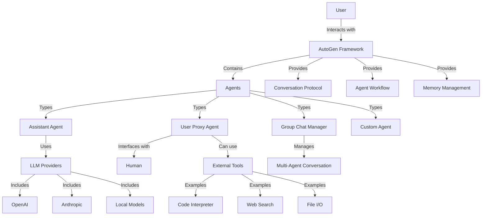

# AutoGen - Code Walkthrough

## Overview

AutoGen is a framework that enables the development of LLM (Large Language Model) applications using multiple agents that can converse with each other to solve tasks. The framework provides conversable agents powered by LLMs, humans, and tools that can be used to build multi-agent systems for various applications.

AutoGen simplifies the orchestration, automation, and optimization of complex LLM workflows. It allows developers to create agents with different roles and capabilities, and then define how these agents interact with each other to accomplish tasks. This multi-agent approach enables more complex reasoning, planning, and problem-solving than what can be achieved with a single LLM.

The framework is designed to be flexible and extensible, allowing developers to customize agents, conversations, and workflows to suit their specific needs. It supports various LLM providers, including OpenAI, Anthropic, and local models, and can be integrated with other tools and services.

## System Architecture

The following diagram shows the key components and their relationships:

## Table of Contents

1. [Core Concepts and Architecture](chapters/chapter_1_core_concepts.md)
2. [Agent Types and Capabilities](chapters/chapter_2_agent_types.md)
3. [Conversation Management](chapters/chapter_3_conversation.md)
4. [Multi-Agent Systems](chapters/chapter_4_multi_agent.md)
5. [Tool Integration](chapters/chapter_5_tools.md)
6. [Memory and Context Management](chapters/chapter_6_memory.md)
7. [LLM Integration](chapters/chapter_7_llm_integration.md)
8. [Advanced Workflows](chapters/chapter_8_workflows.md)
9. [Customization and Extension](chapters/chapter_9_customization.md)
10. [Performance and Optimization](chapters/chapter_10_performance.md)

---

*This tutorial was generated by [EnlightenAI](https://github.com/Mathews-Tom/EnlightenAI), an intelligent codebase explainer.*
