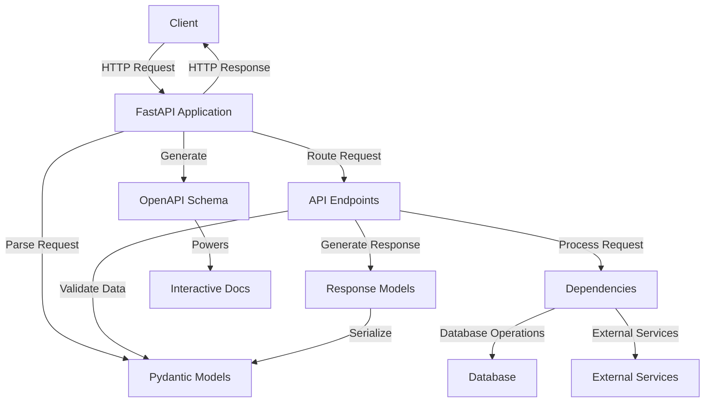

# FastAPI - Code Walkthrough

## Overview

FastAPI is a modern, fast (high-performance) web framework for building APIs with Python 3.7+ based on standard Python type hints. It's designed to be easy to use and learn while providing robust features for building production-ready APIs.

The framework is built on top of Starlette for the web parts and Pydantic for the data parts. This combination allows FastAPI to provide automatic validation, serialization, and documentation of your API, making it one of the most developer-friendly API frameworks available.

FastAPI's key strengths include its speed (on par with NodeJS and Go), automatic interactive documentation, and strong type checking that helps catch errors during development rather than at runtime.

## System Architecture

The following diagram shows the key components and their relationships:

## Table of Contents

1. [Main Application Structure](chapters/chapter_1_main.md)
2. [Routing System](chapters/chapter_2_routing.md)
3. [Request Validation with Pydantic](chapters/chapter_3_pydantic.md)
4. [Dependency Injection System](chapters/chapter_4_dependencies.md)
5. [Security and Authentication](chapters/chapter_5_security.md)
6. [Middleware and CORS](chapters/chapter_6_middleware.md)
7. [Background Tasks](chapters/chapter_7_background.md)
8. [WebSockets Support](chapters/chapter_8_websockets.md)
9. [Testing FastAPI Applications](chapters/chapter_9_testing.md)
10. [OpenAPI and Documentation](chapters/chapter_10_openapi.md)

---

*This tutorial was generated by [EnlightenAI](https://github.com/Mathews-Tom/EnlightenAI), an intelligent codebase explainer.*
