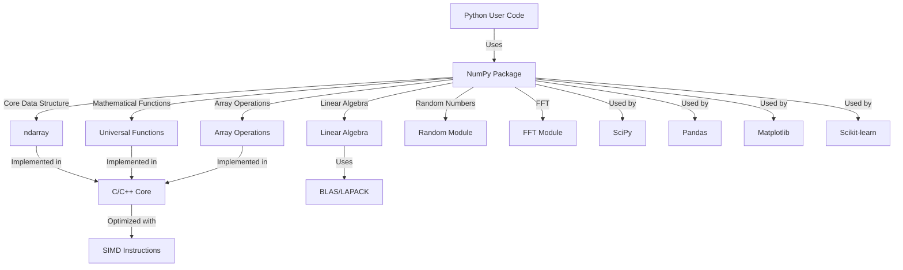

# NumPy - Code Walkthrough

## Overview

NumPy (Numerical Python) is the fundamental package for scientific computing in Python. It provides support for large, multi-dimensional arrays and matrices, along with a large collection of high-level mathematical functions to operate on these arrays. NumPy is the foundation upon which many other scientific Python libraries are built, including SciPy, Matplotlib, pandas, and scikit-learn.

The core of NumPy is the `ndarray` (n-dimensional array) object, which is a fast, flexible container for large datasets in Python. Arrays enable you to perform mathematical operations on whole blocks of data using similar syntax to the equivalent operations between scalar elements.

NumPy's design philosophy focuses on efficiency, vectorization, and broadcasting, which allows for concise and readable code that executes quickly, even for large datasets.

## System Architecture

The following diagram shows the key components and their relationships:

## Table of Contents

1. [Core Array Object](chapters/chapter_1_ndarray.md)
2. [Array Creation](chapters/chapter_2_array_creation.md)
3. [Array Indexing and Slicing](chapters/chapter_3_indexing.md)
4. [Broadcasting](chapters/chapter_4_broadcasting.md)
5. [Universal Functions (ufuncs)](chapters/chapter_5_ufuncs.md)
6. [Linear Algebra](chapters/chapter_6_linear_algebra.md)
7. [Random Number Generation](chapters/chapter_7_random.md)
8. [Fourier Transform](chapters/chapter_8_fft.md)
9. [C API and Extensions](chapters/chapter_9_c_api.md)
10. [Performance Optimization](chapters/chapter_10_optimization.md)

---

*This tutorial was generated by [EnlightenAI](https://github.com/Mathews-Tom/EnlightenAI), an intelligent codebase explainer.*
