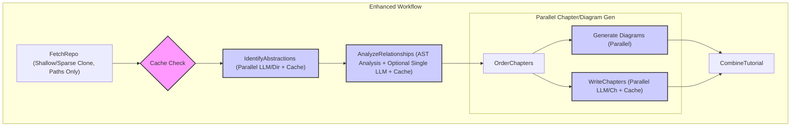
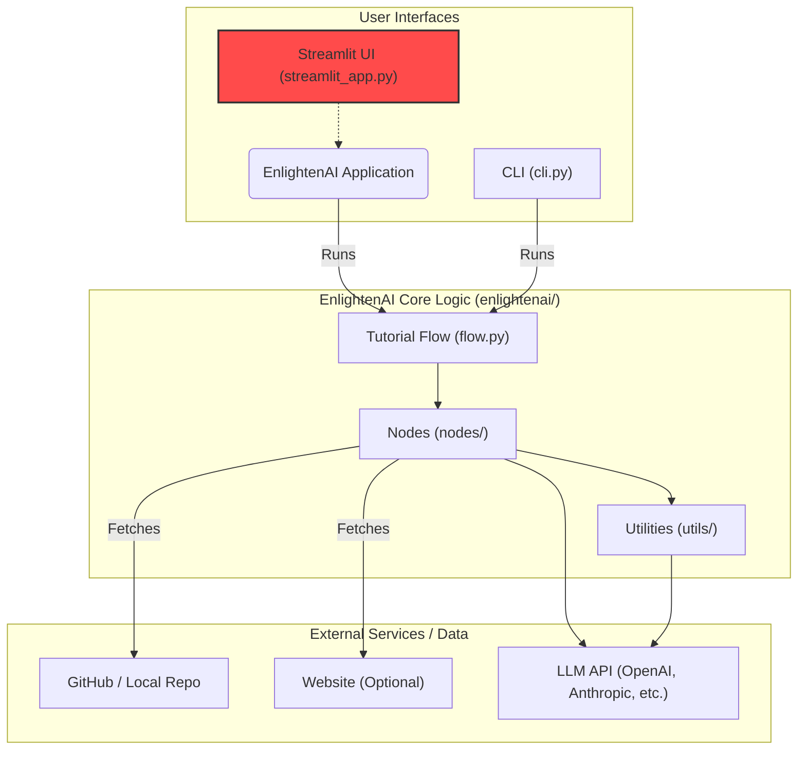

# 🔎 EnlightenAI — System Overview

EnlightenAI is an intelligent codebase explainer that transforms complex repositories into structured, beginner-friendly tutorials. This document provides a detailed overview of the system, its architecture, core workflow, and folder structure.

## 🌐 System Purpose

### EnlightenAI is designed to

- Analyze the structure of any public GitHub repository or local directory.
- Extract meaningful abstractions (e.g., modules, components, classes, functions).
- Understand relationships and dependencies between these components.
- Generate an ordered, human-readable tutorial (in Markdown) explaining the repo’s design, logic, and flow, complete with diagrams.

### It is ideal for

- Onboarding new team members quickly.
- Exploring unfamiliar open-source projects efficiently.
- Documenting existing codebases automatically.
- Turning codebases into educational resources.

## ⚙️ Core Workflow & Nodes

EnlightenAI operates as a modular pipeline orchestrated by a flow defined in `src/enlightenai/flow.py`. Each stage corresponds to a specific `Node` class located in `src/enlightenai/nodes/`:



### Node Descriptions (Reflecting Enhancements)

1. **`FetchRepo` (`fetch_repo_gitin.py`)**:
    - **Input**: GitHub repository URL or local path.
    - **Action**: Efficiently clones the repository (using shallow/sparse clone techniques if applicable) and gathers relevant source code file *paths* based on inclusion/exclusion rules. Avoids loading full content into memory.
    - **Output**: A list of relevant file paths within the cloned repository directory.
2. **`IdentifyAbstractions` (`identify_abstractions.py`)**:
    - **Input**: List of file paths.
    - **Action**: Uses a Large Language Model (LLM) via the caching `llm_client.py` to analyze code (read on demand from paths) and identify key abstractions. LLM calls may be parallelized per directory/group. Checks cache before making API calls.
    - **Output**: A structured list of identified abstractions with descriptions (potentially cached).
3. **`AnalyzeRelationships` (`analyze_relationships.py`)**:
    - **Input**: List of file paths and the list of abstractions.
    - **Action**: Determines connections using efficient direct analysis (e.g., AST parsing for Python) and potentially a consolidated LLM call (via caching `llm_client.py`) if needed. Reads code on demand. Checks cache.
    - **Output**: A graph or map representing the relationships (potentially cached).
4. **`OrderChapters` (`order_chapters.py`)**:
    - **Input**: Abstractions and their relationships.
    - **Action**: Determines a logical reading order for the tutorial chapters.
    - **Output**: An ordered list of abstractions (chapters).
5. **`WriteChapters` (`write_chapters.py`)**:
    - **Input**: Ordered abstractions, relationships, and file paths.
    - **Action**: Generates detailed Markdown content for each chapter using the caching LLM client (calls executed in parallel). Reads code on demand. Diagram generation may run concurrently.
    - **Output**: Individual Markdown files for each chapter (potentially cached).
6. **`CombineTutorial` (`combine_tutorial.py`)**:
    - **Input**: Generated chapter file paths, relationships, diagram data.
    - **Action**: Assembles the main `index.md` file, including title, introduction, relationship diagram, and ordered links to chapter files.
    - **Output**: A complete, structured tutorial in a designated output directory.

## 🧱 System Architecture

The system is primarily driven by a command-line interface and utilizes several utility modules.



### Key Components (Reflecting Enhancements)

- **Command Line Interface (`src/enlightenai/cli.py`)**: Original user entry point; parses arguments and starts the flow.
- **Streamlit UI (`streamlit_app.py`)**: Web-based graphical user interface for easier interaction.
- **Workflow Orchestration (`src/enlightenai/flow.py`)**: Defines the node sequence and manages data flow (primarily file paths and structured data, not full file contents).
- **Nodes (`src/enlightenai/nodes/`)**: Modular units performing pipeline tasks. Optimized for parallel execution (where applicable), on-demand file reading, and leveraging caching. Utilize AST parsing for direct analysis where appropriate.
- **LLM Client (`src/enlightenai/utils/llm_client.py`)**: Abstracts LLM interactions, incorporating **persistent caching** to reduce redundant API calls and latency.
- **Diagram Generator (`src/enlightenai/utils/diagram_generator.py`)**: Creates Mermaid diagrams; potentially runs concurrently with other tasks.
- **HTML Viewer (`src/enlightenai/utils/html_viewer.py`)**: Opens the final tutorial in a browser.

## 📁 Folder Structure

```plaintext
EnlightenAI/
├── .env.example                        # Example environment variables (API keys, etc.)
├── .gitignore                          # Files/directories ignored by Git
├── enhancement_plan.md                 # Ideas for future improvements
├── install_dev.sh                      # Script for setting up development environment
├── LICENSE                             # Project license file
├── overview.md                         # This file: High-level system overview
├── pyproject.toml                      # Project metadata and dependencies (PEP 621)
├── README.md                           # Main project README
├── requirements.txt                    # Python dependencies (alternative format)
├── setup.py                            # Python package setup script (legacy)
├── assets/                             # Static files (logos, banners, examples)
├── docs/                               # General documentation (installation, usage, etc.)
│   └── examples/                       # Example generated tutorials
├── mock_output/                        # Directory for mock/test outputs
├── src/                                # Source code directory
│   └── enlightenai/                    # Main package directory
│       ├── __init__.py
│       ├── cli.py                      # Command Line Interface entry point
│       ├── flow.py                     # Defines the main tutorial generation workflow
│       ├── test_enlightenai.py         # Integration/system tests
│       ├── test_mock.py                # Tests using mock data
│       ├── nodes/                      # Directory for workflow nodes
│       │   ├── __init__.py
│       │   ├── analyze_relationships.py
│       │   ├── combine_tutorial.py
│       │   ├── fetch_repo_gitin.py     # Fetches from Git/local
│       │   ├── fetch_web.py            # (Potentially) Fetches web content
│       │   ├── identify_abstractions.py
│       │   ├── node.py                 # Base class for nodes
│       │   ├── order_chapters.py
│       │   └── write_chapters.py
│       └── utils/                      # Utility functions and classes
│           ├── __init__.py
│           ├── call_llm.py             # (Older?) LLM call utility
│           ├── diagram_generator.py    # Generates Mermaid diagrams
│           ├── formatting.py           # Text formatting helpers
│           ├── html_viewer.py          # Opens generated HTML/MD in browser
│           ├── llm_client.py           # Main client for LLM interactions
│           └── mock_data.py            # Utilities for mock data generation
├── enlightenai.egg-info/               # Build metadata (generated)
└── test_output/                        # Directory for actual test outputs
```

## 🔮 Future Enhancements

With performance and efficiency optimizations now implemented, future efforts can focus on:

- **Multi-Language Support:** Extending analysis capabilities beyond Python (e.g., JavaScript, Java, Go), potentially requiring language-specific AST parsers.
- **Deeper Code Analysis:** Incorporating more advanced analysis like data flow and control flow tracking between components.
- **Richer Visualizations:** Adding more sophisticated diagram types (e.g., UML class diagrams, sequence diagrams) for different perspectives on the architecture.
- **IDE Integration:** Developing plugins or features for real-time code explanations directly within popular IDEs.
- **Web Interface:** Creating a user-friendly web application for easier interaction and browsing generated tutorials.
- **Incremental Updates:** Investigating ways to update tutorials based only on changed files (leveraging Git history and caching).

EnlightenAI aims to be the go-to tool for demystifying codebases, making software development more accessible and collaborative.

