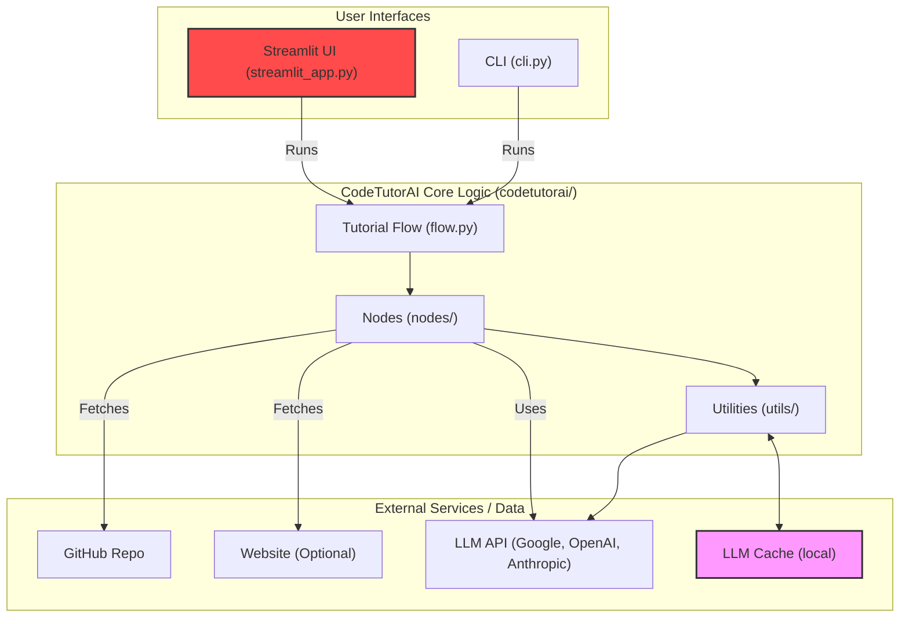
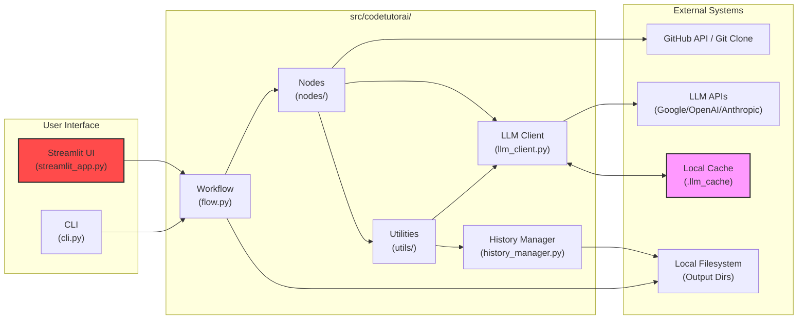

# 🔎 CodeTutorAI — System Overview

CodeTutorAI is an intelligent codebase explainer that transforms complex repositories into structured, beginner-friendly tutorials. This document provides a detailed overview of the system, its architecture, core workflow, and folder structure.

## 🌐 System Purpose

### CodeTutorAI is designed to

- Analyze the structure of any public GitHub repository.
- Extract meaningful abstractions (e.g., modules, components, classes, functions) using LLMs.
- Understand relationships and dependencies between these components.
- Generate an ordered, human-readable tutorial (in Markdown and other formats) explaining the repo’s design, logic, and flow, complete with diagrams.
- Provide an interactive web UI (Streamlit) for easy configuration and use.

### It is ideal for

- Onboarding new team members quickly.
- Exploring unfamiliar open-source projects efficiently.
- Documenting existing codebases automatically.
- Turning codebases into educational resources.

## ⚙️ Core Workflow & Nodes

CodeTutorAI operates as a modular pipeline orchestrated by a flow defined in `src/codetutorai/flow.py`. Each stage corresponds to a specific `Node` class located in `src/codetutorai/nodes/`:



### Node Descriptions

1.  **`FetchRepoGitinNode`**: Clones the repository and gathers relevant source code file paths.
2.  **`FetchWebNode`**: (Optional) Fetches content from a provided website URL for additional context.
3.  **`IdentifyAbstractionsNode`**: Uses an LLM (via caching client) to analyze code and identify key abstractions.
4.  **`AnalyzeRelationshipsNode`**: Determines connections between abstractions using AST parsing and/or LLM analysis (via caching client).
5.  **`OrderChaptersNode`**: Determines a logical reading order for the tutorial chapters based on abstractions and relationships.
6.  **`WriteChaptersNode`**: Generates detailed Markdown content for each chapter using the caching LLM client. Can generate diagrams concurrently.
7.  **`CombineTutorialNode`**: Assembles the final tutorial output (index file, chapters, diagrams) in the specified formats (Markdown, HTML viewer, etc.).

## 🧱 System Architecture

The system can be accessed via the command-line interface or the Streamlit web UI. Both interfaces trigger the core workflow.



### Key Components

- **Streamlit UI (`streamlit_app.py`)**: **Primary** user entry point. Provides a graphical interface for configuration, generation, history viewing, and cache management.
- **Command Line Interface (`src/codetutorai/cli.py`)**: Alternative entry point; parses arguments and starts the flow.
- **Workflow Orchestration (`src/codetutorai/flow.py`)**: Defines the node sequence and manages the context dictionary passed between nodes.
- **Nodes (`src/codetutorai/nodes/`)**: Modular units performing pipeline tasks (fetching, analysis, writing).
- **LLM Client (`src/codetutorai/utils/llm_client.py`)**: Abstracts LLM interactions (Google Gemini, OpenAI, Anthropic), incorporating persistent caching (via `diskcache`) and retry logic. Handles API key management (UI input or `.env` file).
- **History Manager (`src/codetutorai/utils/history_manager.py`)**: Saves and loads generation metadata (URL, config, output path) to a JSON file. Used by the Streamlit UI for the URL history dropdown.
- **Diagram Generator (`src/codetutorai/utils/diagram_generator.py`)**: Creates Mermaid diagrams.
- **HTML Viewer (`src/codetutorai/utils/html_viewer.py`)**: Creates and optionally opens the interactive HTML tutorial viewer.
- **Formatting Utils (`src/codetutorai/utils/formatting.py`)**: Helpers for text, paths, URLs, and duration formatting.
- **Constants (`src/codetutorai/utils/constants.py`)**: Defines default paths and potentially other shared constants.

## 📁 Folder Structure

```plaintext
CodeTutorAI/
├── .env                            # Local environment variables (API keys)
├── .env.example                    # Example environment variables
├── .gitignore                      # Git ignore rules
├── .llm_cache/                     # Default directory for LLM response cache
├── .venv/                          # Python virtual environment (created by user)
├── assets/                         # Logos, banners, etc.
│   ├── CodeTutorAI-Banner.png      # Project Banner Image
│   ├── banner.txt                  # ASCII Art Banner
│   └── logo.txt                    # ASCII Art Logo
├── docs/                           # General documentation (installation, usage, etc.)
│   └── examples/                   # Example generated tutorials
├── LICENSE                         # MIT License
├── overview.md                     # This file: High-level system overview
├── pyproject.toml                  # Project metadata and dependencies (PEP 621)
├── README.md                       # Main project README
├── requirements.txt                # Python dependencies
├── setup.py                        # Package setup script (uses pyproject.toml)
├── src/                            # Source code directory
│   └── codetutorai/                # Main package
│       ├── __init__.py             # Package initialization
│       ├── cli.py                  # Command Line Interface entry point
│       ├── flow.py                 # Defines the main tutorial generation workflow
│       ├── nodes/                  # Directory for workflow nodes
│       │   ├── __init__.py
│       │   ├── node.py             # Base class for nodes
│       │   └── ... (other node files)
│       └── utils/                  # Utility functions and classes
│           ├── __init__.py
│           ├── constants.py
│           ├── diagram_generator.py
│           ├── formatting.py
│           ├── history_manager.py
│           ├── html_viewer.py
│           ├── llm_client.py       # Main client for LLM interactions
│           └── ...
├── streamlit_app.py                # Main Streamlit UI application script
└── tutorial_output/                # Default output directory for tutorials
    ├── generation_history.json     # Tracks generation runs
    └── <user>_<repo>/              # Subdirectory for each generated repo
        ├── index.md
        ├── chapters/
        ├── diagrams/
        └── viewer/                 # If HTML viewer format is selected
```

CodeTutorAI aims to be the go-to tool for demystifying codebases, making software development more accessible and collaborative.
