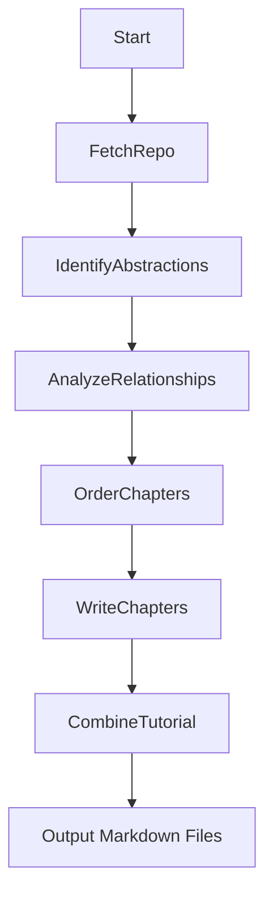
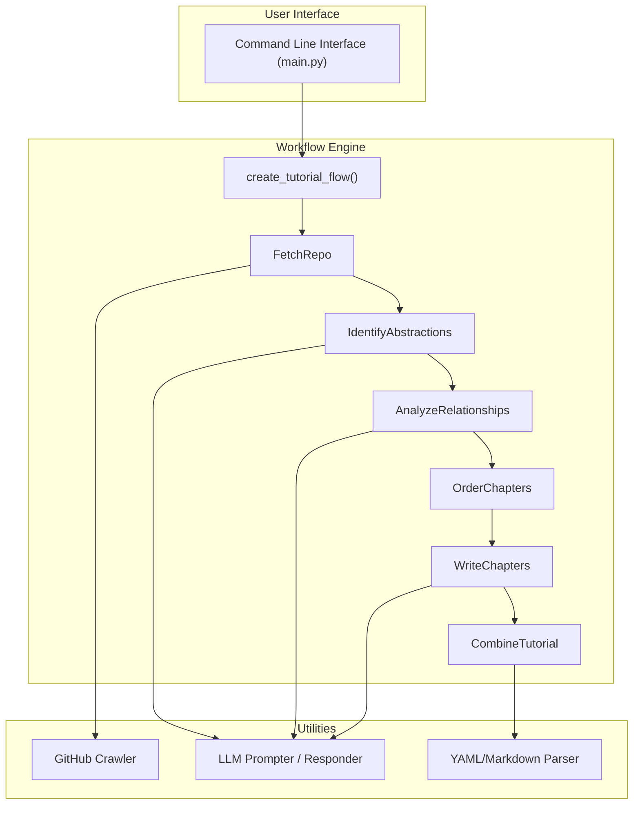

# 🔎 EnlightenAI — System Overview

EnlightenAI is an intelligent codebase explainer that transforms complex repositories into structured, beginner-friendly tutorials. This document provides a high-level overview of the system, its architecture, core workflow, and folder structure.

## 🌐 System Purpose

### EnlightenAI is designed to

- Analyze the structure of any public GitHub repository
- Extract meaningful abstractions (e.g., modules, components, classes)
- Understand relationships and dependencies between components
- Generate an ordered, human-readable tutorial (in Markdown) explaining the repo’s design, logic, and flow

### It is ideal for

- Onboarding new team members
- Exploring unfamiliar open-source projects
- Turning codebases into educational resources

## ⚙️ High-Level Workflow

EnlightenAI operates as a modular AI-driven pipeline. Each stage of the system corresponds to a specific node in the workflow:



### 🔁 Node Descriptions

- FetchRepo: Crawls and fetches code files from the target GitHub repository using filters (e.g., include .py, exclude tests).
- IdentifyAbstractions: Uses LLM prompts to extract key components (classes, modules, systems) from the codebase.
- AnalyzeRelationships: Builds an understanding of how abstractions are connected (e.g., calls, inheritance, imports).
- OrderChapters: Establishes an optimal order for explanation (e.g., foundational components before dependents).
- WriteChapters: Uses LLMs to generate chapter content for each abstraction, with descriptions and code references.
- CombineTutorial: Assembles all chapters and creates an index.md with a Mermaid diagram and project overview.

### 🧱 System Architecture



## Key Components

- PocketFlow Framework: Handles orchestration of each node in the pipeline
- LLM Integration: Pluggable backend (supports OpenAI, Google PaLM, Claude, etc.)
- Mermaid Diagrams: Auto-generated visual maps for architecture understanding
- Markdown Output: Clean, linkable, and easy to publish (e.g., GitHub Pages)

## 📁 Folder Structure

```bash
EnlightenAI/
├── main.py                # CLI entry point
├── flow.py                # Creates the AI tutorial generation flow
├── nodes.py               # Contains logic for each workflow step (Node classes)
├── utils/
│   ├── call_llm.py        # Handles all LLM prompt calls and responses
│   ├── crawl_github.py    # Fetches code files via GitHub API
│   └── formatting.py      # Prompt formatting and Markdown helpers
├── docs/                  # Final output tutorials (index.md, chapters/)
├── assets/                # Static images and Mermaid diagrams
├── requirements.txt       # Python dependencies
├── README.md
└── overview.md            # You are here 👋
```

## 🔮 Future Enhancements

- Multi-language repo support (Python, JS, Go, etc.)
- Richer visualizations (class diagrams, dependency graphs)
- In-browser or IDE-based interactive walkthroughs
- Semantic versioning of tutorials tied to Git commits

EnlightenAI is your magnifying glass for understanding the hidden patterns, logic, and flow buried within complex software projects.
